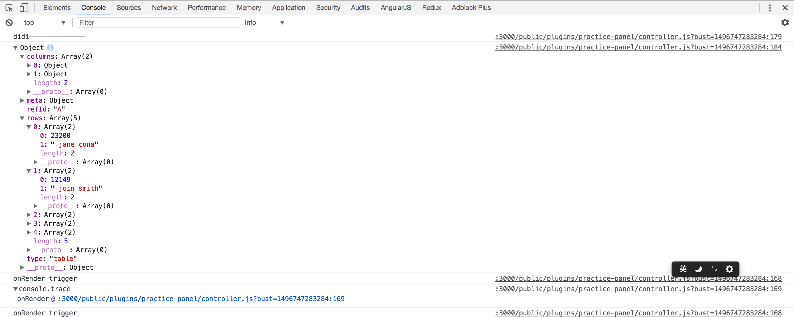

# Grafana 插件开发

上一次分享提到过Grafana的插件氛围三种类型(Panel, Datasource, App),这一次主要记录Panel类型的插件开发.

## 0. 起手式
根据官网的描述, 插件包一般放在`/var/lib/grafana/plugins`或者`data/plugins`(相对Grafana源码目录). 前者是生产环境, 后者是开发环境. 所以我们这一次选择后者, 毕竟一会儿要从源码修改Grafana的前端代码, 然后启动go语言编写的后端.

> 基础知识准备:
> angularjs, systemjs, typescript, jquery, echarts, grunt, nodejs and golang.

## 1. 目录结构
先把官网上说明需要的文件目录加上.

```
johnnyb-awesome-datasource
|-- dist # 存放编译打包后的插件代码
|-- spec # 测试代码
|   |-- datasource_spec.js
|   |-- query_ctrl_spec.js
|   |-- test-main.js
|-- src # 插件源码
|   |-- img # 需要的图片, 比如LOGO, 可选
|   |   |-- logo.svg
|   |-- partials # 界面文件, 可选
|   |   |-- annotations.editor.html
|   |   |-- config.html
|   |   |-- query.editor.html
|   |-- datasource.js
|   |-- module.js # 唯一入口文件
|   |-- plugin.json # 插件描述文件
|   |-- query_ctrl.js
|-- Gruntfile.js # Grunt任务
|-- LICENSE
|-- package.json
|-- README.md # 这也会显示在插件说明中
```

> README.md: The only difference from how GitHub renders markdown is that html is not allowed.

实际上并不需要严格按照上述目录存放文件, 关键点在于: 插件目录下需要有`src/`, `dist/`. `src/`中需要有`module.js`和`plugin.json`. 其他开心就好.

所以实际上, 我的目录结构是这样:

```
practice-panel
|-- dist # 存放编译打包后的插件代码
|-- src # 插件源码
|   |-- partials # 界面文件, 可选
|   |   |-- module.html
|   |   |-- module.editor.html
|   |-- module.js # 唯一入口文件
|   |-- plugin.json # 插件描述文件
|   |-- controller.js # 分离出来的Controller, 也可全部放在module.js里面
|-- Gruntfile.js # Grunt任务描述
|-- package.json
|-- README.md
```

## 2. 插件描述文件(.json)
然后来认识一个文件, 这个文件是用来描述插件的. 包括插件的**唯一**标识, 名字, 作者, 版本等等. 全文是这样的:

```json
{
	"id": "",
	"type": "",
	"name": "",
	"info": {
		"description": "",
		"author": {
			"name": "",
			"url": ""
		},
		"keywords": [],
		"logos": [
			"small": "",
			"large": ""
		],
		"version": ""
	},
	"dependencies": {
		"grafanaVersion": "",
		"plugins": []
	}
}

```

具体的含义, 参考附录中的官方说明链接. 本次的内容参考源码文件.
## 3. 入口文件
这基本上就是约定, Grafana会从插件包的`dist/`第一个读取的文件就是`module.js`文件. 不管用什么语言编写, 最终都要保证`dist/module.js`可读. 

## 4. 可用依赖资源
Grafana的前端模块化方案采用的[Systemjs](https://github.com/systemjs/systemjs). 如果熟悉任何一种模块化方案都行, 这里的影响并不是很大, 除了需要添加依赖资源. 在插件开发过程中, 开发者是**无法添加任何依赖资源**的. 因为插件是作为Grafana前端整体的一部分在运行. 所有的资源配置都写在Grafana源码目录的`public/app/system.conf.js`文件中, 资源都放在`public/vendor/`目录中.

默认可用资源如下:

```
virtual-scroll
mousetrap
remarkable
tether
eventemitter3
tether-drop
moment
jquery
lodash-src
lodash
angular
bootstrap
angular-route
angular-sanitize
angular-ui
angular-strap
angular-dragdrop
angular-bindonce
spectrum
bootstrap-tagsinput
jquery.flot
jquery.flot.pie
jquery.flot.selection
jquery.flot.stack
jquery.flot.stackpercent
jquery.flot.time
jquery.flot.crosshair
jquery.flot.fillbelow
jquery.flot.gauge
d3
jquery.flot.dashes
```

是的, 像D3, jquery, moment, lodash这些非常有用的图表基础库都有了, 甚至很贴心的连AngularJS全家桶都有. 美中不足的是AngularJS版本偏低: `1.6.1`.

但这一次练习, 我们要用echarts来构建图表. 很遗憾, Grafana没有这项资源. 所以总共需要修改二个地方.
 
- 将`echarts.min.js`放入`public/vendor/`目录
- 修改`public/app/system.conf.js`文件, 在`paths`节点中添加代码: `'echarts': 'vendor/echarts.min.js',` 上下文看起来像这样:
	
	```javascript
	'tether-drop': 'vendor/npm/tether-drop/dist/js/drop.js',
	'moment': 'vendor/moment.js',
	'echarts': 'vendor/echarts.min.js',
	'jquery': 'vendor/jquery/dist/jquery.js',

	```

## 5. 开始编码

### MetricsPanelCtrl类

准备工作基本完成了, 但是编码之前, 需要认识一个类: `MetricsPanelCtrl`. 这个类的源码文件位于Grafana源码目录下`public/app/features/panel/metrics_panel_ctrl.ts`. `MetricsPanelCtrl`类继承自`PanelCtrl`类, 是我们完成本次Panel类型插件开发必须要用到的. 它主要是解决了以下三个问题:

1. 在进入编辑状态后, 使metrics Tab成为默认面板.

	```javascript
	constructor($scope, $injector) {
		super($scope, $injector);
		// make metrics tab the default
		this.editorTabIndex = 1;
		// ... other code
	}
	```
2. 订阅事件:
	
	```javascript
	this.events.on('refresh', this.onMetricsPanelRefresh.bind(this));
	this.events.on('init-edit-mode', this.onInitMetricsPanelEditMode.bind(this));
	this.events.on('panel-teardown', this.onPanelTearDown.bind(this));
	```
3. 提供设置数据源后的响应:

	```javascript
	setDatasource(datasource) {
		// ... other code

		this.panel.datasource = datasource.value;
		this.datasourceName = datasource.name;
		this.datasource = null;
		this.refresh();
	}
	```

### 插件事件

因为文档中并无特别描述, 所以以下是**已知的**插件支持的事件:

- `refresh` can be used to response when refresh button was clicked.
- `init-edit-mode` can be used to add tabs when editing a panel
- `panel-teardown` can be used for clean up
- `data-received` is an event in that is triggered on data refresh and can be hooked into
- `data-snapshot-load` is an event triggered to load data when in snapshot mode.
- `data-error` is used to handle errors on dashboard refresh.

### 编写一个controller.js

Controller类必须实现link方法或者init方法. 这是Grafana的插件机制决定的. 与此同时, Controller的实例对象也将作为AngularJS组件的上下文对象存在.

```javascript
// app/core/directives/plugin_component.ts
function getPluginComponentDirective(options) {
	// other code
	return function() {
		return {
			// other code
			link: (scope, elem, attrs, ctrl) => {
				if (ctrl.link) {
					ctrl.link(scope, elem, attrs, ctrl);
				}
				if (ctrl.init) {
					ctrl.init();
				}
			}
		}
	}
}
```

而这个函数是作为AngularJS的指令处理函数存在的. 所以我们的controller.js看起来至少应该是这样的:

```javascript
import { MetricsPanelCtrl } from 'app/plugins/sdk';

export class Controller extends MetricsPanelCtrl {
	constructor() {
		// initialize
		// subscribe events
	}
	
	link(scope, elem, attrs, ctrl) {
		// impelement linking
	}
}
```

*完整实现细节请参考源码文件.*

是的, 此时还没有界面. 在编写界面之前, 我们先了解一下插件的二种状态.

## 6. 插件状态

插件有二种状态, 一种是只读状态, 一种是编辑状态. 只读状态就是打开一个dashboard时各个Panel表现的状态. 编辑状态是点击"Edit"之后, 进入的可以影响数据源的状态. 我们需要分别为这二种状态编写页面.

*完整实现细节参考源码文件.*

## 7. HTML + CSS

Grafana提供一些布局样式和外观样式. 非常不幸, 我没有在官方文档上找到对应的样式说明. 不过幸运的是, 插件目前只有三种, 而且三种都提供了Example代码. 分别是:

[https://github.com/grafana/piechart-panel](https://github.com/grafana/piechart-panel)
[https://github.com/grafana/simple-json-datasource](https://github.com/grafana/simple-json-datasource)
[https://github.com/grafana/kubernetes-app](https://github.com/grafana/kubernetes-app)

这一次练习则是copy的piechart-panel的编辑页面. 用起来有点类似bootstrap的感觉.

好了, 重点来了: **在编写完成界面后, 需要将界面和controller关联在一起.**

只读状态的界面关联方法是在controller.js中声明完Controller类后, 添加静态属性字段:

```javascript
Controller.templateUrl = './partials/module.html';
```

编辑状态的界面则需要在`init-edit-mode`事件处理函数中注册:

```javascript
onInitEditMode() {
	this.addEditorTab('Options', 'public/plugins/practice-panel/partials/module.editor.html', 2);
}
```
*完整实现细节参考源码文件.*

## 8. 编译打包

编译Grafana官方使用的是Grunt, 实际上只要按照目录结构来, 用什么打包工具并不重要.

`grunt`

一个练习插件就这么完成了.

## 9. 总结

一种数据的四种表现形式. 其中右下角红色的柱状图即本次练习插件.

图表数据Grafana只支持二种, 时序图和非时序图. 非时序图仅返回一个普通的数据结构:





## 附录

- [官方开发指南](http://docs.grafana.org/plugins/developing/development/)
- [官方插件示例](https://github.com/grafana/piechart-panel)
- [插件描述文件说明](http://docs.grafana.org/plugins/developing/plugin.json/)
